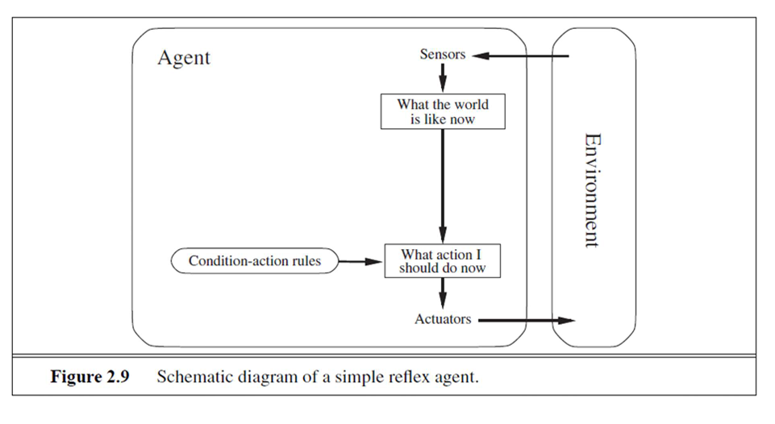
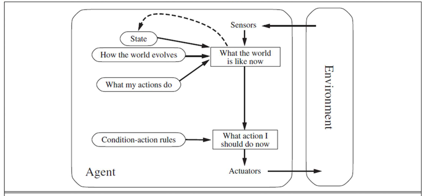
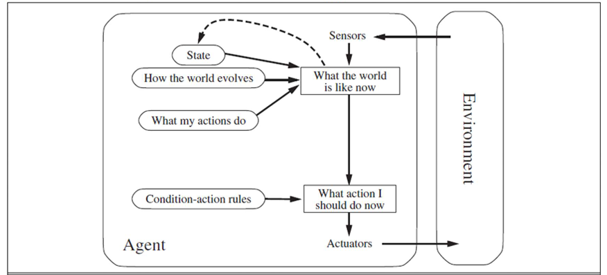
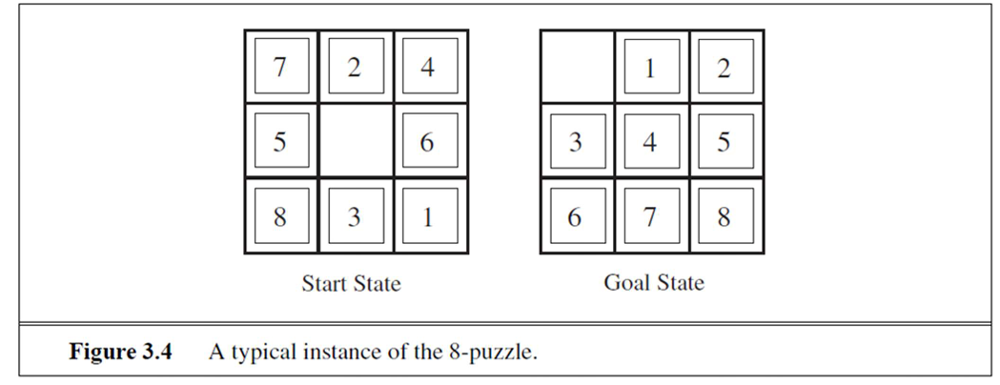

# TRÍ TUỆ NHÂN TẠO 2
LE QUANG MINH

---

## KHÁI NIỆM VỀ TÍNH HỢP LÝ (THE CONCEPT OF RATIONALITY)

**Quan sát được hoàn toàn (Fully observable) vs. quan sát được một phần (partially observable):** Nếu các cảm biến của một tác nhân cho phép nó truy cập vào trạng thái hoàn chỉnh của môi trường tại mỗi thời điểm, thì chúng ta nói rằng môi trường tác vụ là quan sát được hoàn toàn. Một môi trường tác vụ thực sự là quan sát được hoàn toàn nếu các cảm biến phát hiện tất cả các khía cạnh *liên quan* đến việc lựa chọn hành động; sự liên quan, đến lượt nó, phụ thuộc vào thước đo hiệu suất. Môi trường quan sát được hoàn toàn rất tiện lợi vì tác nhân không cần duy trì bất kỳ trạng thái nội bộ nào để theo dõi thế giới. Một môi trường có thể quan sát được một phần do các cảm biến nhiễu và không chính xác hoặc do các phần của trạng thái đơn giản là bị thiếu trong dữ liệu cảm biến—ví dụ, một tác nhân hút bụi chỉ có cảm biến bụi cục bộ không thể biết liệu có bụi ở các ô vuông khác hay không, và một chiếc taxi tự động không thể thấy những gì các tài xế khác đang nghĩ. Nếu tác nhân hoàn toàn không có cảm biến thì môi trường là **không quan sát được (unobservable)**. Người ta có thể nghĩ rằng trong những trường hợp như vậy, tình thế của tác nhân là vô vọng, nhưng, như chúng ta thảo luận trong Chương 4, các mục tiêu của tác nhân vẫn có thể đạt được, đôi khi với sự chắc chắn.

**Xác định (Deterministic) vs. ngẫu nhiên (stochastic):** Nếu trạng thái tiếp theo của môi trường được xác định hoàn toàn bởi trạng thái hiện tại và hành động được thực hiện bởi tác nhân, thì chúng ta nói môi trường là xác định; ngược lại, nó là ngẫu nhiên. Về nguyên tắc, một tác nhân không cần lo lắng về sự không chắc chắn trong một môi trường xác định, quan sát được hoàn toàn. (Trong định nghĩa của chúng ta, chúng ta bỏ qua sự không chắc chắn nảy sinh hoàn toàn từ hành động của các tác nhân khác trong môi trường đa tác nhân; do đó, một trò chơi có thể là xác định mặc dù mỗi tác nhân có thể không dự đoán được hành động của những người khác.) Tuy nhiên, nếu môi trường quan sát được một phần, thì nó *có thể xuất hiện* là ngẫu nhiên. Hầu hết các tình huống thực tế đều phức tạp đến mức không thể theo dõi tất cả các khía cạnh không được quan sát; vì mục đích thực tế, chúng phải được coi là ngẫu nhiên. Việc lái xe taxi rõ ràng là ngẫu nhiên theo nghĩa này, bởi vì người ta không bao giờ có thể dự đoán chính xác hành vi của giao thông; hơn nữa, lốp xe của một người bị nổ và động cơ của một người bị hỏng mà không có cảnh báo trước. Thế giới máy hút bụi như chúng ta mô tả là xác định, nhưng các biến thể có thể bao gồm các yếu tố ngẫu nhiên như bụi xuất hiện ngẫu nhiên và cơ chế hút không đáng tin cậy (Bài tập 2.13). Chúng ta nói một môi trường là **không chắc chắn (uncertain)** nếu nó không quan sát được hoàn toàn hoặc không xác định. Một lưu ý cuối cùng: việc chúng ta sử dụng từ "ngẫu nhiên" thường ngụ ý rằng sự không chắc chắn về kết quả được định lượng bằng xác suất; một môi trường **phi xác định (nondeterministic)** là một môi trường trong đó các hành động được đặc trưng bởi các kết quả có thể có của chúng, nhưng không có xác suất nào được gắn vào chúng. Các mô tả môi trường phi xác định thường được liên kết với các thước đo hiệu suất yêu cầu tác nhân thành công cho tất cả các kết quả có thể có của hành động của nó.

**Theo từng giai đoạn (Episodic) vs. tuần tự (sequential):** Trong một môi trường tác vụ theo từng giai đoạn, kinh nghiệm của tác nhân được chia thành các giai đoạn nguyên tử. Trong mỗi giai đoạn, tác nhân nhận một nhận thức và sau đó thực hiện một hành động duy nhất. Quan trọng là, giai đoạn tiếp theo không phụ thuộc vào các hành động được thực hiện trong các giai đoạn trước. Nhiều tác vụ phân loại là theo từng giai đoạn. Ví dụ, một tác nhân phải phát hiện các bộ phận bị lỗi trên dây chuyền lắp ráp sẽ dựa vào quyết định của mình dựa trên bộ phận hiện tại, bất kể các quyết định trước đó; hơn nữa, quyết định hiện tại không ảnh hưởng đến việc bộ phận tiếp theo có bị lỗi hay không. Mặt khác, trong môi trường tuần tự, quyết định hiện tại có thể ảnh hưởng đến tất cả các quyết định trong tương lai. Cờ vua và lái xe taxi là tuần tự: trong cả hai trường hợp, các hành động ngắn hạn có thể có hậu quả dài hạn. Môi trường theo từng giai đoạn đơn giản hơn nhiều so với môi trường tuần tự vì tác nhân không cần phải suy nghĩ trước.

**Tĩnh (Static) vs. động (dynamic):** Nếu môi trường có thể thay đổi trong khi một tác nhân đang cân nhắc, thì chúng ta nói môi trường đó là động đối với tác nhân đó; ngược lại, nó là tĩnh. Môi trường tĩnh dễ đối phó vì tác nhân không cần phải liên tục quan sát thế giới trong khi quyết định hành động, cũng không cần lo lắng về sự trôi qua của thời gian. Mặt khác, môi trường động liên tục hỏi tác nhân muốn làm gì; nếu nó chưa quyết định, điều đó được coi là quyết định không làm gì cả. Nếu bản thân môi trường không thay đổi theo thời gian nhưng điểm hiệu suất của tác nhân lại thay đổi, thì chúng ta nói môi trường đó là **bán động (semidynamic)**. Lái xe taxi rõ ràng là động: những chiếc xe khác và chính chiếc taxi vẫn tiếp tục di chuyển trong khi thuật toán lái xe đang phân vân xem phải làm gì tiếp theo. Cờ vua, khi chơi với đồng hồ, là bán động. Câu đố ô chữ là tĩnh.

**Rời rạc (Discrete) vs. liên tục (continuous):** Sự phân biệt rời rạc/liên tục áp dụng cho trạng thái của môi trường, cách xử lý thời gian, cũng như nhận thức và hành động của tác nhân. Ví dụ, môi trường cờ vua có một số lượng hữu hạn các trạng thái riêng biệt (không bao gồm đồng hồ). Cờ vua cũng có một tập hợp rời rạc các nhận thức và hành động. Lái xe taxi là một vấn đề trạng thái liên tục và thời gian liên tục: tốc độ và vị trí của taxi và các phương tiện khác quét qua một loạt các giá trị liên tục và diễn ra một cách trơn tru theo thời gian. Các hành động lái xe taxi cũng liên tục (góc lái, v.v.). Đầu vào từ camera kỹ thuật số là rời rạc, nói một cách chính xác, nhưng thường được coi là đại diện cho cường độ và vị trí thay đổi liên tục.

**Biết trước (Known) vs. chưa biết (unknown):** Nói một cách chính xác, sự phân biệt này không đề cập đến bản thân môi trường mà là trạng thái kiến thức của tác nhân (hoặc người thiết kế) về "quy luật vật lý" của môi trường. Trong một môi trường biết trước, kết quả (hoặc xác suất kết quả nếu môi trường là ngẫu nhiên) cho tất cả các hành động đều được đưa ra. Rõ ràng, nếu môi trường chưa biết, tác nhân sẽ phải học cách nó hoạt động để đưa ra quyết định tốt. Lưu ý rằng sự phân biệt giữa môi trường biết trước và chưa biết không giống như sự phân biệt giữa môi trường quan sát được hoàn toàn và quan sát được một phần. Hoàn toàn có thể xảy ra trường hợp một môi trường biết trước lại quan sát được một phần—ví dụ, trong các trò chơi bài solitaire, tôi biết luật chơi nhưng vẫn không thể nhìn thấy những lá bài chưa được lật. Ngược lại, một môi trường chưa biết có thể quan sát được hoàn toàn—trong một trò chơi điện tử mới, màn hình có thể hiển thị toàn bộ trạng thái trò chơi nhưng tôi vẫn không biết các nút làm gì cho đến khi tôi thử chúng.

Như người ta có thể mong đợi, trường hợp khó nhất là quan sát được một phần, đa tác nhân, ngẫu nhiên, tuần tự, động, liên tục và chưa biết. Lái xe taxi khó khăn ở tất cả các khía cạnh này, ngoại trừ việc phần lớn môi trường của người lái xe là đã biết. Lái một chiếc xe thuê ở một quốc gia mới với địa lý và luật lệ giao thông xa lạ sẽ thú vị hơn rất nhiều.

---

## CẤU TRÚC CỦA TÁC NHÂN (THE STRUCTURE OF AGENTS)

Cho đến nay, chúng ta đã nói về các tác nhân bằng cách mô tả *hành vi*—hành động được thực hiện sau bất kỳ chuỗi nhận thức nào đã cho. Bây giờ chúng ta phải đối mặt với vấn đề và nói về cách thức hoạt động bên trong. Công việc của AI là thiết kế một **chương trình tác nhân (agent program)** thực hiện hàm tác nhân—ánh xạ từ nhận thức sang hành động. Chúng ta giả định chương trình này sẽ chạy trên một loại thiết bị tính toán nào đó có cảm biến và bộ truyền động vật lý—chúng ta gọi đây là **kiến trúc (architecture)**:

```
tác nhân = kiến trúc + chương trình
```

Rõ ràng, chương trình chúng ta chọn phải phù hợp với kiến trúc. Nếu chương trình định đề xuất các hành động như *Đi bộ*, thì kiến trúc tốt hơn nên có chân. Kiến trúc có thể chỉ là một PC thông thường, hoặc nó có thể là một chiếc ô tô robot với một số máy tính, camera và các cảm biến khác trên bo mạch. Nói chung, kiến trúc cung cấp các nhận thức từ các cảm biến cho chương trình, chạy chương trình và cung cấp các lựa chọn hành động của chương trình cho các bộ truyền động khi chúng được tạo ra. Hầu hết cuốn sách này là về thiết kế các chương trình tác nhân, mặc dù Chương 24 và 25 đề cập trực tiếp đến các cảm biến và bộ truyền động.

Các chương trình tác nhân mà chúng ta thiết kế trong cuốn sách này đều có cùng một bộ khung: chúng nhận nhận thức hiện tại làm đầu vào từ các cảm biến và trả về một hành động cho các bộ truyền động. Lưu ý sự khác biệt giữa chương trình tác nhân, nhận nhận thức hiện tại làm đầu vào, và hàm tác nhân, nhận toàn bộ lịch sử nhận thức. Chương trình tác nhân chỉ nhận nhận thức hiện tại làm đầu vào vì không có gì hơn từ môi trường; nếu hành động của tác nhân cần phụ thuộc vào toàn bộ chuỗi nhận thức, tác nhân sẽ phải ghi nhớ các nhận thức đó.

Chúng ta mô tả các chương trình tác nhân bằng ngôn ngữ mã giả đơn giản được định nghĩa trong Phụ lục B. (Kho lưu trữ mã trực tuyến chứa các triển khai bằng các ngôn ngữ lập trình thực tế).

Việc xem xét tại sao cách tiếp cận dựa trên bảng (table-driven) để xây dựng tác nhân lại thất bại là điều bổ ích. Gọi P là tập hợp các nhận thức có thể có và T là thời gian sống của tác nhân (tổng số nhận thức mà nó sẽ nhận được). Bảng tra cứu sẽ chứa Σ<sup>T</sup><sub>t=1</sub> |P|<sup>t</sup> mục. Hãy xem xét chiếc taxi tự động: đầu vào hình ảnh từ một camera duy nhất đến với tốc độ khoảng 27 megabyte mỗi giây (30 khung hình mỗi giây, 640 × 480 pixel với 24 bit thông tin màu). Điều này tạo ra một bảng tra cứu với hơn 10<sup>250.000.000.000</sup> mục cho một giờ lái xe. Ngay cả bảng tra cứu cho cờ vua—một mảnh nhỏ, hoạt động tốt của thế giới thực—cũng sẽ có ít nhất 10<sup>150</sup> mục. Kích thước đáng sợ của các bảng này (số lượng nguyên tử trong vũ trụ quan sát được nhỏ hơn 10<sup>80</sup>) có nghĩa là (a) không một tác nhân vật lý nào trong vũ trụ này có đủ không gian để lưu trữ bảng, (b) người thiết kế sẽ không có thời gian để tạo ra bảng, (c) không một tác nhân nào có thể học được tất cả các mục đúng của bảng từ kinh nghiệm của mình, và (d) ngay cả khi môi trường đủ đơn giản để tạo ra một bảng có kích thước khả thi, người thiết kế vẫn không có hướng dẫn nào về cách điền các mục trong bảng.

Mặc dù vậy, TABLE-DRIVEN-AGENT *thực sự* làm những gì chúng ta muốn: nó thực hiện hàm tác nhân mong muốn. Thách thức chính đối với AI là tìm ra cách viết các chương trình, trong chừng mực có thể, tạo ra hành vi hợp lý từ một chương trình nhỏ hơn thay vì từ một bảng khổng lồ. Chúng ta có nhiều ví dụ cho thấy điều này có thể được thực hiện thành công trong các lĩnh vực khác: ví dụ, các bảng căn bậc hai khổng lồ được các kỹ sư và học sinh sử dụng trước những năm 1970 hiện đã được thay thế bằng một chương trình năm dòng cho phương pháp Newton chạy trên máy tính điện tử. Câu hỏi đặt ra là, liệu AI có thể làm được điều tương tự cho hành vi thông minh nói chung như Newton đã làm cho căn bậc hai không? Chúng tôi tin rằng câu trả lời là có.

Trong phần còn lại của mục này, chúng tôi phác thảo bốn loại chương trình tác nhân cơ bản thể hiện các nguyên tắc làm nền tảng cho hầu hết các hệ thống thông minh:

*   Tác nhân phản xạ đơn giản (Simple reflex agents);
*   Tác nhân phản xạ dựa trên mô hình (Model-based reflex agents);
*   Tác nhân dựa trên mục tiêu (Goal-based agents); và
*   Tác nhân dựa trên hữu dụng (Utility-based agents).

---

## TÁC NHÂN PHẢN XẠ ĐƠN GIẢN (SIMPLE REFLEX AGENT)

Các hành vi phản xạ đơn giản xảy ra ngay cả trong các môi trường phức tạp hơn. Hãy tưởng tượng bạn là người lái chiếc taxi tự động. Nếu chiếc xe phía trước phanh và đèn phanh của nó sáng lên, thì bạn nên nhận thấy điều này và bắt đầu phanh. Nói cách khác, một số xử lý được thực hiện trên đầu vào hình ảnh để thiết lập điều kiện mà chúng ta gọi là "Xe phía trước đang phanh." Sau đó, điều này kích hoạt một số kết nối đã được thiết lập trong chương trình tác nhân với hành động "bắt đầu phanh." Chúng ta gọi một kết nối như vậy là **quy tắc điều kiện-hành động (condition-action rule)**, được viết là:

```
nếu xe-phía-trước-đang-phanh thì bắt-đầu-phanh.
```

Con người cũng có nhiều kết nối như vậy, một số là phản ứng đã học (như khi lái xe) và một số là phản xạ bẩm sinh (chẳng hạn như chớp mắt khi có vật gì đó đến gần mắt). Trong suốt cuốn sách, chúng tôi trình bày một số cách khác nhau để các kết nối như vậy có thể được học và triển khai.

Chương trình trong Hình 2.8 (không được cung cấp trong OCR) dành riêng cho một môi trường máy hút bụi cụ thể. Một cách tiếp cận tổng quát và linh hoạt hơn là trước tiên xây dựng một bộ thông dịch đa năng cho các quy tắc điều kiện-hành động và sau đó tạo các bộ quy tắc cho các môi trường tác vụ cụ thể. Hình 2.9 (xem bên dưới) đưa ra cấu trúc của chương trình tổng quát này ở dạng sơ đồ, cho thấy cách các quy tắc điều kiện-hành động (hoạt động).


```
function REFLEX-VACUUM-AGENT([location,status]) returns an action
    if status = Dirty then return Suck
    else if location = A then return Right
    else if location = B then return Left
```


**Hình 2.8** Chương trình tác nhân cho một tác nhân phản xạ đơn giản trong môi trường máy hút bụi hai trạng thái. Chương trình này thực hiện hàm tác nhân được lập bảng trong Hình 2.3 (không được cung cấp trong OCR).

---



*(Đánh dấu để bổ sung Hình 2.9: Sơ đồ của một tác nhân phản xạ đơn giản.)*
**Hình 2.9** Sơ đồ của một tác nhân phản xạ đơn giản.
*(Mô tả: Mũi tên từ Môi trường (Environment) đến Cảm biến (Sensors) của Tác nhân (Agent). Từ Cảm biến, mũi tên đến hộp "Thế giới bây giờ như thế nào (What the world is like now)". Từ hộp này, mũi tên đến hộp "Tôi nên làm hành động gì bây giờ (What action I should do now)". Một mũi tên từ "Quy tắc điều kiện-hành động (Condition-action rules)" cũng trỏ đến hộp "Tôi nên làm hành động gì bây giờ". Từ hộp "Tôi nên làm hành động gì bây giờ", mũi tên đến Bộ truyền động (Actuators). Từ Bộ truyền động, mũi tên trở lại Môi trường.)*

---

```
function SIMPLE-REFLEX-AGENT(percept) returns an action
    persistent: rules, a set of condition-action rules

    state ← INTERPRET-INPUT(percept)
    rule ← RULE-MATCH(state, rules)
    action ← rule.ACTION
    return action
```
**Hình 2.10** Một tác nhân phản xạ đơn giản. Nó hành động theo một quy tắc có điều kiện khớp với trạng thái hiện tại, được xác định bởi nhận thức.

---

Chúng ta có thể thấy một vấn đề tương tự phát sinh trong thế giới máy hút bụi. Giả sử một tác nhân hút bụi phản xạ đơn giản bị tước mất cảm biến vị trí và chỉ có cảm biến bụi. Một tác nhân như vậy chỉ có hai nhận thức có thể có: [Bẩn (Dirty)] và [Sạch (Clean)]. Nó có thể Hút (Suck) để đáp ứng với [Bẩn]; nó nên làm gì để đáp ứng với [Sạch]? Di chuyển Sang trái (Left) sẽ thất bại (mãi mãi) nếu nó tình cờ bắt đầu ở ô vuông A, và di chuyển Sang phải (Right) sẽ thất bại (mãi mãi) nếu nó tình cờ bắt đầu ở ô vuông B. Các vòng lặp vô hạn thường không thể tránh khỏi đối với các tác nhân phản xạ đơn giản hoạt động trong môi trường quan sát được một phần.

Thoát khỏi các vòng lặp vô hạn là có thể nếu tác nhân có thể **ngẫu nhiên hóa (randomize)** các hành động của mình. Ví dụ, nếu tác nhân hút bụi nhận thấy [Sạch], nó có thể tung đồng xu để chọn giữa Trái và Phải. Dễ dàng chỉ ra rằng tác nhân sẽ đến ô vuông kia trung bình sau hai bước. Sau đó, nếu ô vuông đó bẩn, tác nhân sẽ làm sạch nó và nhiệm vụ sẽ hoàn thành. Do đó, một tác nhân phản xạ đơn giản được ngẫu nhiên hóa có thể hoạt động tốt hơn một tác nhân phản xạ đơn giản xác định.

---

## TÁC NHÂN PHẢN XẠ DỰA TRÊN MÔ HÌNH (MODEL-BASED REFLEX AGENTS)

Cách hiệu quả nhất để xử lý khả năng quan sát một phần là để tác nhân theo dõi phần thế giới mà nó không thể nhìn thấy hiện tại. Nghĩa là, tác nhân nên duy trì một loại **trạng thái nội bộ (internal state)** phụ thuộc vào lịch sử nhận thức và do đó phản ánh ít nhất một số khía cạnh không được quan sát của trạng thái hiện tại. Đối với vấn đề phanh, trạng thái nội bộ không quá rộng rãi—chỉ là khung hình trước đó từ camera, cho phép tác nhân phát hiện khi hai đèn đỏ ở rìa xe bật hoặc tắt đồng thời. Đối với các tác vụ lái xe khác như chuyển làn, tác nhân cần theo dõi vị trí của các xe khác nếu nó không thể nhìn thấy tất cả chúng cùng một lúc. Và để có thể lái xe, tác nhân cần theo dõi vị trí chìa khóa của mình.

Việc cập nhật thông tin trạng thái nội bộ này theo thời gian đòi hỏi hai loại kiến thức phải được mã hóa trong chương trình tác nhân. Thứ nhất, chúng ta cần một số thông tin về cách thế giới tự tiến triển độc lập với tác nhân—ví dụ, một chiếc xe vượt nói chung sẽ ở gần phía sau hơn so với một khoảnh khắc trước đó. Thứ hai, chúng ta cần một số thông tin về cách hành động của chính tác nhân ảnh hưởng đến thế giới—ví dụ, khi tác nhân xoay vô lăng theo chiều kim đồng hồ, xe rẽ sang phải, hoặc sau khi lái xe năm phút về phía bắc trên đường cao tốc, người ta thường ở cách vị trí năm phút trước đó khoảng năm dặm về phía bắc. Kiến thức này về "cách thế giới hoạt động"—cho dù được triển khai trong các mạch Boolean đơn giản hay trong các lý thuyết khoa học hoàn chỉnh—được gọi là **mô hình (model)** của thế giới. Một tác nhân sử dụng một mô hình như vậy được gọi là **tác nhân dựa trên mô hình (model-based agent)**.



**Hình 2.11** Một tác nhân phản xạ dựa trên mô hình.
*(Mô tả: Tương tự như Hình 2.9, nhưng trong Tác nhân, có một hộp "Trạng thái (State)". Mũi tên từ "Trạng thái" đến "Thế giới tiến hóa như thế nào (How the world evolves)" và "Hành động của tôi làm gì (What my actions do)". Mũi tên từ "Thế giới tiến hóa như thế nào" và "Hành động của tôi làm gì" trỏ đến một điểm, từ đó mũi tên đi đến hộp "Thế giới bây giờ như thế nào". Cũng có một mũi tên nét đứt từ "Trạng thái" đến "Thế giới bây giờ như thế nào".)*

---

Hình 2.11 (xem ở trên) đưa ra cấu trúc của tác nhân phản xạ dựa trên mô hình với trạng thái nội bộ, cho thấy cách nhận thức hiện tại được kết hợp với trạng thái nội bộ cũ để tạo ra mô tả cập nhật của trạng thái hiện tại, dựa trên mô hình của tác nhân về cách thế giới hoạt động. Chương trình tác nhân được hiển thị trong Hình 2.12 (xem bên dưới). Phần thú vị là hàm UPDATE-STATE.

```
function MODEL-BASED-REFLEX-AGENT(percept) returns an action
    persistent: state, the agent's current conception of the world state
                model, a description of how the next state depends on current state and action
                rules, a set of condition-action rules
                action, the most recent action, initially none

    state ← UPDATE-STATE(state, action, percept, model)
    rule ← RULE-MATCH(state, rules)
    action ← rule.ACTION
    return action
```


**Hình 2.12** Một tác nhân phản xạ dựa trên mô hình. Nó theo dõi trạng thái hiện tại của thế giới, sử dụng một mô hình nội bộ. Sau đó, nó chọn một hành động giống như cách tác nhân phản xạ.

Nó chịu trách nhiệm tạo ra mô tả trạng thái nội bộ mới. Chi tiết về cách các mô hình và trạng thái được biểu diễn rất khác nhau tùy thuộc vào loại môi trường và công nghệ cụ thể được sử dụng trong thiết kế tác nhân. Các ví dụ chi tiết về các mô hình và thuật toán cập nhật xuất hiện trong các Chương 4, 12, 11, 15, 17 và 25.

---

## GIẢI QUYẾT VẤN ĐỀ BẰNG TÌM KIẾM (SOLVING PROBLEM BY SEARCHING)

Hãy tưởng tượng một tác nhân ở thành phố Arad, Romania, đang tận hưởng một kỳ nghỉ du lịch. Thước đo hiệu suất của tác nhân chứa nhiều yếu tố: nó muốn cải thiện làn da rám nắng, cải thiện tiếng Romania, ngắm cảnh, tận hưởng cuộc sống về đêm (nếu có), tránh say xỉn, v.v. Vấn đề quyết định là một vấn đề phức tạp liên quan đến nhiều sự đánh đổi và việc đọc kỹ sách hướng dẫn. Bây giờ, giả sử tác nhân có một vé máy bay không hoàn lại để bay khỏi Bucharest vào ngày hôm sau. Trong trường hợp đó, việc tác nhân đặt mục tiêu đến Bucharest là hợp lý. Các hướng hành động không đến Bucharest đúng giờ có thể bị từ chối mà không cần xem xét thêm và vấn đề quyết định của tác nhân được đơn giản hóa rất nhiều. Mục tiêu giúp tổ chức hành vi bằng cách giới hạn các mục tiêu mà tác nhân đang cố gắng đạt được và do đó là các hành động mà nó cần xem xét. **Hình thành mục tiêu (Goal formulation)**, dựa trên tình hình hiện tại và thước đo hiệu suất của tác nhân, là bước đầu tiên trong giải quyết vấn đề.

Chúng ta sẽ coi một **mục tiêu (goal)** là một tập hợp các trạng thái thế giới—chính xác là những trạng thái mà mục tiêu được thỏa mãn. Nhiệm vụ của tác nhân là tìm ra cách hành động, bây giờ và trong tương lai, để nó đạt được một trạng thái mục tiêu. Trước khi có thể làm điều này, nó cần phải quyết định (hoặc chúng ta cần quyết định thay mặt nó) loại hành động và trạng thái nào nó nên xem xét. Nếu nó xem xét các hành động ở cấp độ "di chuyển chân trái về phía trước một inch" hoặc "xoay vô lăng sang trái một độ," tác nhân có lẽ sẽ không bao giờ tìm được đường ra khỏi bãi đậu xe, chứ đừng nói đến Bucharest, bởi vì ở cấp độ chi tiết đó có quá nhiều sự không chắc chắn trên thế giới và sẽ có quá nhiều bước trong một giải pháp. **Hình thành vấn đề (Problem formulation)** là quá trình quyết định những hành động và trạng thái nào cần xem xét, với một mục tiêu nhất định. Chúng ta sẽ thảo luận chi tiết hơn về quá trình này sau. Hiện tại, chúng ta hãy giả định rằng tác nhân sẽ xem xét các hành động ở cấp độ lái xe từ một thị trấn lớn này sang một thị trấn lớn khác. Do đó, mỗi trạng thái tương ứng với việc đang ở một thị trấn cụ thể.

Tác nhân của chúng ta bây giờ đã đặt mục tiêu lái xe đến Bucharest và đang xem xét đi đâu từ Arad. Ba con đường dẫn ra khỏi Arad, một con đường về phía Sibiu, một con đường đến Timisoara, và một con đường đến Zerind. Không có con đường nào trong số này đạt được mục tiêu, vì vậy trừ khi tác nhân quen thuộc với địa lý của Romania, nó sẽ không biết nên đi theo con đường nào. Nói cách khác, tác nhân sẽ không biết hành động nào trong số các hành động có thể có của nó là tốt nhất, bởi vì nó chưa biết đủ về trạng thái kết quả từ việc thực hiện mỗi hành động. Nếu tác nhân không có thông tin bổ sung—tức là, nếu môi trường là *chưa biết* theo nghĩa được định nghĩa trong Mục 2.3—thì nó không có lựa chọn nào khác ngoài việc thử một trong các hành động một cách ngẫu nhiên. Tình huống đáng buồn này được thảo luận trong Chương 4.

Nhưng giả sử tác nhân có một bản đồ của Romania. Điểm của một bản đồ là cung cấp cho tác nhân thông tin về các trạng thái mà nó có thể gặp phải và các hành động mà nó có thể thực hiện. Tác nhân có thể sử dụng thông tin này để xem xét các giai đoạn tiếp theo của một hành trình giả định qua mỗi thị trấn trong ba thị trấn, cố gắng tìm một hành trình cuối cùng đến được Bucharest. Một khi nó đã tìm thấy một con đường trên bản đồ từ Arad đến Bucharest, nó có thể đạt được mục tiêu của mình bằng cách thực hiện các hành động lái xe tương ứng với các chặng của hành trình. Nói chung, một tác nhân có một số tùy chọn trước mắt có giá trị chưa biết có thể quyết định phải làm gì bằng cách trước tiên kiểm tra các hành động trong tương lai cuối cùng dẫn đến các trạng thái có giá trị đã biết.

chúng ta giả định rằng môi trường là **quan sát được (observable)**, vì vậy tác nhân luôn biết trạng thái hiện tại. Đối với tác nhân lái xe ở Romania, việc giả định rằng mỗi thành phố trên bản đồ đều có một biển báo cho biết sự hiện diện của nó cho các tài xế đến là hợp lý. Chúng ta cũng giả định môi trường là **rời rạc (discrete)**, vì vậy tại bất kỳ trạng thái nào đã cho, chỉ có một số hữu hạn các hành động để lựa chọn. Điều này đúng khi điều hướng ở Romania vì mỗi thành phố được kết nối với một số ít các thành phố khác. Chúng ta sẽ giả định môi trường là **biết trước (known)**, vì vậy tác nhân biết trạng thái nào đạt được bằng mỗi hành động. (Việc có một bản đồ chính xác là đủ để đáp ứng điều kiện này cho các vấn đề điều hướng.) Cuối cùng, chúng ta giả định môi trường là **xác định (deterministic)**, vì vậy mỗi hành động chỉ có một kết quả duy nhất. Trong điều kiện lý tưởng, điều này đúng với tác nhân ở Romania—điều đó có nghĩa là nếu nó chọn lái xe từ Arad đến Sibiu, nó sẽ đến được Sibiu. Tất nhiên, các điều kiện không phải lúc nào cũng lý tưởng, như chúng ta sẽ thấy trong Chương 4.

Quá trình tìm kiếm một chuỗi các hành động đạt được mục tiêu được gọi là **tìm kiếm (search)**. Một thuật toán tìm kiếm nhận một vấn đề làm đầu vào và trả về một **giải pháp (solution)** dưới dạng một chuỗi hành động. Khi một giải pháp được tìm thấy, các hành động mà nó đề xuất có thể được thực hiện. Đây được gọi là **giai đoạn thực thi (execution phase)**. Do đó, chúng ta có một thiết kế "hình thành, tìm kiếm, thực thi" đơn giản cho tác nhân, như được hiển thị trong Hình 3.1 (không được cung cấp trong OCR). Sau khi hình thành một mục tiêu và một vấn đề cần giải quyết, tác nhân gọi một thủ tục tìm kiếm để giải quyết nó. Sau đó, nó sử dụng giải pháp để hướng dẫn các hành động của mình, thực hiện bất cứ điều gì giải pháp đề xuất là việc cần làm tiếp theo—thường là hành động đầu tiên của chuỗi—và sau đó loại bỏ bước đó khỏi chuỗi. Khi giải pháp đã được thực thi, tác nhân sẽ hình thành một mục tiêu mới.

Lưu ý rằng trong khi tác nhân đang thực hiện chuỗi giải pháp, nó bỏ qua các nhận thức của mình khi chọn một hành động bởi vì nó biết trước chúng sẽ là gì. Một tác nhân thực hiện kế hoạch của mình với đôi mắt nhắm nghiền, nói nôm na là vậy, phải khá chắc chắn về những gì đang diễn ra. Các nhà lý thuyết điều khiển gọi đây là một **hệ thống vòng hở (open-loop system)**, bởi vì việc bỏ qua các nhận thức sẽ phá vỡ vòng lặp giữa tác nhân và môi trường.

Đầu tiên, chúng tôi mô tả quy trình hình thành vấn đề, sau đó dành phần lớn chương cho các thuật toán khác nhau cho hàm SEARCH. Chúng tôi không thảo luận thêm về hoạt động của các hàm UPDATE-STATE và FORMULATE-GOAL trong chương này.

### 3.1.1 Các vấn đề và giải pháp được xác định rõ ràng

Một vấn đề có thể được định nghĩa chính thức bằng năm thành phần:

*   **Trạng thái ban đầu (initial state)** mà tác nhân bắt đầu. Ví dụ, trạng thái ban đầu cho tác nhân của chúng ta ở Romania có thể được mô tả là *ĐangỞ(Arad)* (In(Arad)).
*   Một mô tả về các **hành động (actions)** có thể có sẵn cho tác nhân. Với một trạng thái *s* cụ thể, ACTIONS(*s*) trả về tập hợp các hành động có thể được thực hiện trong *s*. Chúng ta nói rằng mỗi hành động này là **áp dụng được (applicable)** trong *s*. Ví dụ, từ trạng thái *ĐangỞ(Arad)*, các hành động áp dụng được là {*ĐiĐến(Sibiu)* (Go(Sibiu)), *ĐiĐến(Timisoara)*, *ĐiĐến(Zerind)*}.
*   Một mô tả về những gì mỗi hành động thực hiện; tên chính thức cho điều này là **mô hình chuyển tiếp (transition model)**, được chỉ định bởi một hàm RESULT(*s*, *a*) trả về trạng thái kết quả từ việc thực hiện hành động *a* trong trạng thái *s*. Chúng ta cũng sử dụng thuật ngữ **trạng thái kế tiếp (successor)** để chỉ bất kỳ trạng thái nào có thể đạt được từ một trạng thái nhất định bằng một hành động duy nhất. Ví dụ, chúng ta có:
    RESULT(*ĐangỞ(Arad)*, *ĐiĐến(Zerind)*) = *ĐangỞ(Zerind)*.

Cùng với nhau, trạng thái ban đầu, các hành động và mô hình chuyển tiếp ngầm định nghĩa **không gian trạng thái (state space)** của vấn đề—tập hợp tất cả các trạng thái có thể đạt được từ trạng thái ban đầu bằng bất kỳ chuỗi hành động nào. Không gian trạng thái tạo thành một mạng hoặc **đồ thị (graph)** có hướng trong đó các nút là trạng thái và các liên kết giữa các nút là hành động. (Bản đồ Romania được hiển thị trong Hình 3.2 (không được cung cấp trong OCR) có thể được hiểu là một đồ thị không gian trạng thái nếu chúng ta xem mỗi con đường là đại diện cho hai hành động lái xe, một theo mỗi hướng.) Một **đường đi (path)** trong không gian trạng thái là một chuỗi các trạng thái được kết nối bởi một chuỗi các hành động.

*   **Kiểm tra mục tiêu (goal test)**, xác định xem một trạng thái nhất định có phải là trạng thái mục tiêu hay không. Đôi khi có một tập hợp rõ ràng các trạng thái mục tiêu có thể có, và bài kiểm tra chỉ đơn giản là kiểm tra xem trạng thái đã cho có phải là một trong số đó hay không. Mục tiêu của tác nhân ở Romania là tập hợp đơn lẻ {*ĐangỞ(Bucharest)*} .
*   Một **hàm chi phí đường đi (path cost function)** gán một chi phí số cho mỗi đường đi. Tác nhân giải quyết vấn đề chọn một hàm chi phí phản ánh thước đo hiệu suất của chính nó. Đối với tác nhân đang cố gắng đến Bucharest, thời gian là điều cốt yếu, vì vậy chi phí của một đường đi có thể là chiều dài của nó tính bằng kilomet. Trong chương này, chúng ta giả định rằng chi phí của một đường đi có thể được mô tả bằng tổng chi phí của các hành động riêng lẻ dọc theo đường đi đó. **Chi phí bước (step cost)** của việc thực hiện hành động *a* trong trạng thái *s* để đạt được trạng thái *s'* được ký hiệu là *c(s, a, s')*. Chi phí bước cho Romania được hiển thị trong Hình 3.2 dưới dạng khoảng cách tuyến đường. Chúng ta giả định rằng chi phí bước là không âm.

Các yếu tố trên xác định một vấn đề và có thể được tập hợp thành một cấu trúc dữ liệu duy nhất được cung cấp làm đầu vào cho một thuật toán giải quyết vấn đề. Một **giải pháp (solution)** cho một vấn đề là một chuỗi hành động dẫn từ trạng thái ban đầu đến trạng thái mục tiêu. Chất lượng giải pháp được đo bằng hàm chi phí đường đi, và một **giải pháp tối ưu (optimal solution)** có chi phí đường đi thấp nhất trong số tất cả các giải pháp.

---

## CÁC VÍ DỤ VỀ VẤN ĐỀ (EXAMPLE PROBLEMS)

### 3.2.1 Vấn đề đồ chơi (Toy problems)

Ví dụ đầu tiên chúng ta xem xét là **thế giới máy hút bụi (vacuum world)** được giới thiệu lần đầu tiên trong Chương 2. (Xem Hình 2.2 (không được cung cấp trong OCR).) Điều này có thể được xây dựng như một vấn đề như sau:

*   **Trạng thái (States):** Trạng thái được xác định bởi cả vị trí của tác nhân và vị trí của bụi. Tác nhân ở một trong hai vị trí, mỗi vị trí có thể có hoặc không có bụi. Do đó, có 2 × 2<sup>2</sup> = 8 trạng thái thế giới có thể có. Một môi trường lớn hơn với *n* vị trí có *n* · 2<sup>*n*</sup> trạng thái.
*   **Trạng thái ban đầu (Initial state):** Bất kỳ trạng thái nào cũng có thể được chỉ định là trạng thái ban đầu.
*   **Hành động (Actions):** Trong môi trường đơn giản này, mỗi trạng thái chỉ có ba hành động: *Trái (Left)*, *Phải (Right)*, và *Hút (Suck)*. Các môi trường lớn hơn cũng có thể bao gồm *Lên (Up)* và *Xuống (Down)*.
*   **Mô hình chuyển tiếp (Transition model):** Các hành động có tác dụng mong đợi, ngoại trừ việc di chuyển *Trái* ở ô vuông ngoài cùng bên trái, di chuyển *Phải* ở ô vuông ngoài cùng bên phải, và *Hút* ở một ô vuông sạch không có tác dụng. Không gian trạng thái hoàn chỉnh được hiển thị trong Hình 3.3 (không được cung cấp trong OCR).
*   **Kiểm tra mục tiêu (Goal test):** Điều này kiểm tra xem tất cả các ô vuông có sạch không.
*   **Chi phí đường đi (Path cost):** Mỗi bước tốn 1, vì vậy chi phí đường đi là số bước trong đường đi.

So với thế giới thực, vấn đề đồ chơi này có các vị trí rời rạc, bụi rời rạc, việc làm sạch đáng tin cậy và nó không bao giờ bẩn hơn. Chương 4 nới lỏng một số giả định này.

**Câu đố 8 ô (8-puzzle)**, một ví dụ được hiển thị trong Hình 3.4 (xem bên dưới), bao gồm một bảng 3×3 với tám ô được đánh số và một khoảng trống. Một ô liền kề với khoảng trống có thể trượt vào khoảng trống đó. Mục tiêu là đạt được một trạng thái mục tiêu được chỉ định, chẳng hạn như trạng thái được hiển thị ở bên phải của hình. Công thức tiêu chuẩn như sau:



**Hình 3.4** Một ví dụ điển hình của câu đố 8 ô.
*(Mô tả: Hai lưới 3x3. Lưới bên trái "Trạng thái bắt đầu (Start State)" có các số: hàng 1 [7, 2, 4], hàng 2 [5, trống, 6], hàng 3 [8, 3, 1]. Lưới bên phải "Trạng thái mục tiêu (Goal State)" có các số: hàng 1 [1, 2, trống], hàng 2 [3, 4, 5], hàng 3 [6, 7, 8].)*

---

*   **Trạng thái (States):** Một mô tả trạng thái chỉ định vị trí của mỗi trong số tám ô và khoảng trống trong một trong chín ô vuông.
*   **Trạng thái ban đầu (Initial state):** Bất kỳ trạng thái nào cũng có thể được chỉ định là trạng thái ban đầu. Lưu ý rằng bất kỳ mục tiêu nào đã cho đều có thể đạt được từ đúng một nửa số trạng thái ban đầu có thể có (Bài tập 3.5).
*   **Hành động (Actions):** Công thức đơn giản nhất định nghĩa các hành động là sự di chuyển của khoảng trống *Trái (Left)*, *Phải (Right)*, *Lên (Up)*, hoặc *Xuống (Down)*. Các tập hợp con khác nhau của những hành động này là có thể tùy thuộc vào vị trí của khoảng trống.
*   **Mô hình chuyển tiếp (Transition model):** Với một trạng thái và hành động, điều này trả về trạng thái kết quả; ví dụ, nếu chúng ta áp dụng *Trái* cho trạng thái bắt đầu trong Hình 3.4, trạng thái kết quả sẽ có số 5 và khoảng trống bị hoán đổi.
*   **Kiểm tra mục tiêu (Goal test):** Điều này kiểm tra xem trạng thái có khớp với cấu hình mục tiêu được hiển thị trong Hình (3.4) hay không.
*   **Chi phí đường đi (Path cost):** Mỗi bước tốn 1, vì vậy chi phí đường đi là số bước trong đường đi.

Chúng ta đã bao gồm những trừu tượng hóa nào ở đây? Các hành động được trừu tượng hóa thành trạng thái bắt đầu và trạng thái cuối cùng của chúng, bỏ qua các vị trí trung gian mà khối đang trượt. Chúng ta đã trừu tượng hóa các hành động như lắc bảng khi các mảnh bị kẹt và loại bỏ việc lấy các mảnh ra bằng dao và đặt chúng trở lại. Chúng ta còn lại một mô tả về các quy tắc của câu đố, tránh tất cả các chi tiết của thao tác vật lý.

Câu đố 8 ô thuộc họ **câu đố khối trượt (sliding-block puzzles)**, thường được sử dụng làm vấn đề kiểm tra cho các thuật toán tìm kiếm mới trong AI. Họ này được biết là NP-đầy đủ, vì vậy người ta không mong đợi tìm thấy các phương pháp tốt hơn đáng kể trong trường hợp xấu nhất so với các thuật toán tìm kiếm được mô tả trong chương này và chương tiếp theo. Câu đố 8 ô có 9!/2 = 181.440 trạng thái có thể đạt được và dễ dàng giải được. Câu đố 15 ô (trên bảng 4 × 4) có khoảng 1,3 nghìn tỷ trạng thái, và các trường hợp ngẫu nhiên có thể được giải quyết tối ưu trong vài mili giây bằng các thuật toán tìm kiếm tốt nhất. Câu đố 24 ô (trên bảng 5 × 5) có khoảng 10<sup>25</sup> trạng thái, và các trường hợp ngẫu nhiên mất vài giờ để giải quyết tối ưu.

Mục tiêu của **bài toán 8 quân hậu (8-queens problem)** là đặt tám quân hậu lên một bàn cờ sao cho không có quân hậu nào tấn công quân hậu nào khác. (Một quân hậu tấn công bất kỳ quân cờ nào trong cùng hàng, cột hoặc đường chéo.) Hình 3.5 (xem bên dưới) cho thấy một giải pháp thử nghiệm thất bại: quân hậu ở cột ngoài cùng bên phải bị quân hậu ở trên cùng bên trái tấn công.


**Hình 3.5** Gần như là một giải pháp cho bài toán 8 quân hậu. (Giải pháp được để lại như một bài tập.)
*(Mô tả: Một bàn cờ 8x8 với các quân hậu được đặt. Các vị trí quân hậu (hàng, cột, 1 là trên cùng/trái cùng): (1,2), (2,4), (3,6), (4,1), (5,3), (6,5), (7,7), (8,8). Quân hậu ở (1,2) tấn công quân hậu ở (8,8) theo đường chéo.)*

---

Mặc dù các thuật toán chuyên dụng hiệu quả tồn tại cho vấn đề này và cho toàn bộ họ *n*-quân hậu, nó vẫn là một vấn đề kiểm tra hữu ích cho các thuật toán tìm kiếm. Có hai loại hình thành chính. Một **hình thành gia tăng (incremental formulation)** liên quan đến các toán tử làm tăng mô tả trạng thái, bắt đầu bằng một trạng thái trống; đối với bài toán 8 quân hậu, điều này có nghĩa là mỗi hành động thêm một quân hậu vào trạng thái. Một **hình thành trạng thái hoàn chỉnh (complete-state formulation)** bắt đầu với tất cả 8 quân hậu trên bàn cờ và di chuyển chúng xung quanh. Trong cả hai trường hợp, chi phí đường đi không được quan tâm vì chỉ có trạng thái cuối cùng mới được tính. Công thức gia tăng đầu tiên mà người ta có thể thử là như sau:

*   **Trạng thái (States):** Bất kỳ sự sắp xếp nào của 0 đến 8 quân hậu trên bàn cờ đều là một trạng thái.
*   **Trạng thái ban đầu (Initial state):** Không có quân hậu nào trên bàn cờ.
*   **Hành động (Actions):** Thêm một quân hậu vào bất kỳ ô vuông trống nào.
*   **Mô hình chuyển tiếp (Transition model):** Trả về bàn cờ với một quân hậu được thêm vào ô vuông được chỉ định.
*   **Kiểm tra mục tiêu (Goal test):** 8 quân hậu ở trên bàn cờ, không quân nào bị tấn công.

Trong công thức này, chúng ta có 64 · 63 · ... · 57 ≈ 1.8 × 10<sup>14</sup> chuỗi có thể để điều tra. Một công thức tốt hơn sẽ cấm đặt một quân hậu vào bất kỳ ô vuông nào đã bị tấn công:

*   **Trạng thái (States):** Tất cả các cách sắp xếp có thể có của *n* quân hậu (0 ≤ *n* ≤ 8), một quân mỗi cột trong *n* cột ngoài cùng bên trái, không có quân hậu nào tấn công quân hậu nào khác.
*   **Hành động (Actions):** Thêm một quân hậu vào bất kỳ ô vuông nào trong cột trống ngoài cùng bên trái sao cho nó không bị tấn công bởi bất kỳ quân hậu nào khác.

Công thức này làm giảm không gian trạng thái của bài toán 8 quân hậu từ 1.8 × 10<sup>14</sup> xuống chỉ còn 2.057, và các giải pháp rất dễ tìm. Mặt khác, đối với 100 quân hậu, việc giảm từ khoảng 10<sup>400</sup> trạng thái xuống còn khoảng 10<sup>52</sup> trạng thái (Bài tập 3.6)—một cải tiến lớn, nhưng không đủ để làm cho vấn đề có thể giải quyết được. Mục 4.1 mô tả công thức trạng thái hoàn chỉnh, và Chương 6 đưa ra một thuật toán đơn giản giải quyết ngay cả bài toán triệu quân hậu một cách dễ dàng.

Vấn đề đồ chơi cuối cùng của chúng tôi được Donald Knuth (1964) nghĩ ra và minh họa cách các không gian trạng thái vô hạn có thể phát sinh. Knuth phỏng đoán rằng, bắt đầu với số 4, một chuỗi các phép toán giai thừa, căn bậc hai và làm tròn xuống sẽ đạt được bất kỳ số nguyên dương mong muốn nào. Ví dụ, chúng ta có thể đạt được 5 từ 4 như sau:
⌊√√√√(4!)!⌋ = 5.
Định nghĩa vấn đề rất đơn giản:

*   **Trạng thái (States):** Số dương.
*   **Trạng thái ban đầu (Initial state):** 4.
*   **Hành động (Actions):** Áp dụng phép toán giai thừa, căn bậc hai hoặc làm tròn xuống (giai thừa chỉ dành cho số nguyên).
*   **Mô hình chuyển tiếp (Transition model):** Như được đưa ra bởi các định nghĩa toán học của các phép toán.
*   **Kiểm tra mục tiêu (Goal test):** Trạng thái là số nguyên dương mong muốn.

Theo hiểu biết của chúng tôi, không có giới hạn nào về mức độ lớn của một số có thể được tạo ra trong quá trình đạt được một mục tiêu nhất định—ví dụ, số 620.448.401.733.239.439.360.000 được tạo ra trong biểu thức cho 5—vì vậy không gian trạng thái cho vấn đề này là vô hạn. Các không gian trạng thái như vậy thường xuyên phát sinh trong các tác vụ liên quan đến việc tạo ra các biểu thức toán học, mạch, bằng chứng, chương trình và các đối tượng được định nghĩa đệ quy khác.

---

## VẤN ĐỀ THẾ GIỚI THỰC (REAL WORLD PROBLEM)

Chúng ta đã thấy cách **vấn đề tìm đường (route-finding problem)** được định nghĩa dưới dạng các vị trí được chỉ định và các chuyển tiếp dọc theo các liên kết giữa chúng. Các thuật toán tìm đường được sử dụng trong nhiều ứng dụng khác nhau. Một số, chẳng hạn như các trang web và hệ thống trong ô tô cung cấp chỉ đường lái xe, là các phần mở rộng tương đối đơn giản của ví dụ Romania. Những ứng dụng khác, chẳng hạn như định tuyến các luồng video trong mạng máy tính, lập kế hoạch hoạt động quân sự và hệ thống lập kế hoạch du lịch hàng không, liên quan đến các đặc tả phức tạp hơn nhiều. Hãy xem xét các vấn đề du lịch hàng không phải được giải quyết bởi một trang web lập kế hoạch du lịch:

*   **Trạng thái (States):** Mỗi trạng thái rõ ràng bao gồm một vị trí (ví dụ: một sân bay) và thời gian hiện tại. Hơn nữa, bởi vì chi phí của một hành động (một chặng bay) có thể phụ thuộc vào các chặng trước đó, cơ sở giá vé của chúng và tình trạng của chúng là nội địa hay quốc tế, trạng thái phải ghi lại thông tin bổ sung về các khía cạnh "lịch sử" này.
*   **Trạng thái ban đầu (Initial state):** Điều này được chỉ định bởi truy vấn của người dùng.
*   **Hành động (Actions):** Thực hiện bất kỳ chuyến bay nào từ vị trí hiện tại, ở bất kỳ hạng ghế nào, khởi hành sau thời gian hiện tại, để lại đủ thời gian để chuyển tiếp trong sân bay nếu cần.
*   **Mô hình chuyển tiếp (Transition model):** Trạng thái kết quả từ việc thực hiện một chuyến bay sẽ có điểm đến của chuyến bay là vị trí hiện tại và thời gian đến của chuyến bay là thời gian hiện tại.
*   **Kiểm tra mục tiêu (Goal test):** Chúng ta có đang ở điểm đến cuối cùng do người dùng chỉ định không?
*   **Chi phí đường đi (Path cost):** Điều này phụ thuộc vào chi phí tiền tệ, thời gian chờ đợi, thời gian bay, thủ tục hải quan và nhập cư, chất lượng ghế ngồi, thời gian trong ngày, loại máy bay, giải thưởng dặm bay thường xuyên, v.v.

Các hệ thống tư vấn du lịch thương mại sử dụng một công thức vấn đề kiểu này, với nhiều phức tạp bổ sung để xử lý các cấu trúc giá vé phức tạp mà các hãng hàng không áp đặt. Tuy nhiên, bất kỳ khách du lịch dày dạn kinh nghiệm nào cũng biết rằng không phải tất cả các chuyến bay đều diễn ra theo kế hoạch. Một hệ thống thực sự tốt nên bao gồm các kế hoạch dự phòng—chẳng hạn như đặt chỗ dự phòng trên các chuyến bay thay thế—trong chừng mực chúng được biện minh bởi chi phí và khả năng thất bại của kế hoạch ban đầu.

**Vấn đề du lịch (Touring problems)** có liên quan chặt chẽ đến các vấn đề tìm đường, nhưng có một điểm khác biệt quan trọng. Ví dụ, hãy xem xét vấn đề "Thăm mọi thành phố trong Hình 3.2 ít nhất một lần, bắt đầu và kết thúc ở Bucharest." Cũng như tìm đường, các hành động tương ứng với các chuyến đi giữa các thành phố liền kề. Tuy nhiên, không gian trạng thái lại khá khác biệt. Mỗi trạng thái không chỉ phải bao gồm vị trí hiện tại mà còn cả tập hợp các thành phố mà tác nhân đã đến thăm. Vì vậy, trạng thái ban đầu sẽ là *ĐangỞ(Bucharest)*, *ĐãThăm({Bucharest})*, một trạng thái trung gian điển hình sẽ là *ĐangỞ(Vaslui)*, *ĐãThăm({Bucharest, Urziceni, Vaslui})*, và bài kiểm tra mục tiêu sẽ kiểm tra xem tác nhân có ở Bucharest và tất cả 20 thành phố đã được đến thăm hay không.

**Bài toán người bán hàng du lịch (traveling salesperson problem - TSP)** là một bài toán du lịch trong đó mỗi thành phố phải được đến thăm đúng một lần. Mục đích là tìm ra chuyến đi ngắn nhất. Vấn đề này được biết là NP-khó, nhưng một lượng lớn nỗ lực đã được đầu tư để cải thiện khả năng của các thuật toán TSP. Ngoài việc lập kế hoạch các chuyến đi cho người bán hàng du lịch, các thuật toán này đã được sử dụng cho các tác vụ như lập kế hoạch chuyển động của các mũi khoan bảng mạch tự động và của các máy xếp hàng trên sàn xưởng.

Một **vấn đề bố trí VLSI (VLSI layout problem)** đòi hỏi phải định vị hàng triệu thành phần và kết nối trên một con chip để giảm thiểu diện tích, giảm thiểu độ trễ mạch, giảm thiểu điện dung lạc và tối đa hóa năng suất sản xuất. Vấn đề bố trí xảy ra sau giai đoạn thiết kế logic và thường được chia thành hai phần: **bố trí ô (cell layout)** và **định tuyến kênh (channel routing)**. Trong bố trí ô, các thành phần nguyên thủy của mạch được nhóm thành các ô, mỗi ô thực hiện một số chức năng được công nhận. Mỗi ô có một dấu chân cố định (kích thước và hình dạng) và yêu cầu một số lượng kết nối nhất định với mỗi ô khác. Mục đích là đặt các ô trên chip sao cho chúng không chồng chéo và có đủ chỗ cho các dây kết nối được đặt giữa các ô.

Định tuyến kênh tìm một tuyến đường cụ thể cho mỗi dây thông qua các khoảng trống giữa các ô. Những vấn đề tìm kiếm này cực kỳ phức tạp, nhưng chắc chắn đáng để giải quyết. Sau này trong chương này, chúng tôi trình bày một số thuật toán có khả năng giải quyết chúng.

**Điều hướng robot (Robot navigation)** là một sự khái quát hóa của vấn đề tìm đường được mô tả trước đó. Thay vì đi theo một tập hợp các tuyến đường rời rạc, một robot có thể di chuyển trong một không gian liên tục với (về nguyên tắc) một tập hợp vô hạn các hành động và trạng thái có thể có. Đối với một robot hình tròn di chuyển trên một bề mặt phẳng, không gian về cơ bản là hai chiều. Khi robot có tay và chân hoặc bánh xe cũng phải được điều khiển, không gian tìm kiếm trở nên nhiều chiều. Các kỹ thuật nâng cao được yêu cầu chỉ để làm cho không gian tìm kiếm hữu hạn. Chúng tôi xem xét một số phương pháp này trong Chương 25. Ngoài sự phức tạp của vấn đề, robot thực tế cũng phải đối phó với các lỗi trong việc đọc cảm biến và điều khiển động cơ của chúng.

Sau khi xây dựng một số vấn đề, bây giờ chúng ta cần giải quyết chúng. Một giải pháp là một chuỗi hành động, vì vậy các thuật toán tìm kiếm hoạt động bằng cách xem xét các chuỗi hành động có thể có khác nhau. Các chuỗi hành động có thể có bắt đầu từ trạng thái ban đầu tạo thành một **cây tìm kiếm (search tree)** với trạng thái ban đầu ở gốc; các nhánh là hành động và các **nút (nodes)** tương ứng với các trạng thái trong không gian trạng thái của vấn đề. Hình 3.6 (không được cung cấp trong OCR) cho thấy một vài bước đầu tiên trong việc phát triển cây tìm kiếm để tìm một tuyến đường từ Arad đến Bucharest. Nút gốc của cây tương ứng với trạng thái ban đầu, *ĐangỞ(Arad)*. Bước đầu tiên là kiểm tra xem đây có phải là trạng thái mục tiêu hay không. (Rõ ràng là không, nhưng điều quan trọng là phải kiểm tra để chúng ta có thể giải quyết các vấn đề mẹo như "bắt đầu ở Arad, đến Arad.") Sau đó, chúng ta cần xem xét việc thực hiện các hành động khác nhau. Chúng ta làm điều này bằng cách **mở rộng (expanding)** trạng thái hiện tại; nghĩa là, áp dụng từng hành động hợp pháp cho trạng thái hiện tại, do đó tạo ra một tập hợp các trạng thái mới. Trong trường hợp này, chúng ta thêm ba nhánh từ nút cha *ĐangỞ(Arad)* dẫn đến ba nút con mới: *ĐangỞ(Sibiu)*, *ĐangỞ(Timisoara)*, và *ĐangỞ(Zerind)*. Bây giờ chúng ta phải chọn một trong ba khả năng này để xem xét thêm.

Đây là bản chất của tìm kiếm—theo dõi một tùy chọn ngay bây giờ và đặt các tùy chọn khác sang một bên để sử dụng sau, trong trường hợp lựa chọn đầu tiên không dẫn đến giải pháp. Giả sử chúng ta chọn Sibiu trước. Chúng ta kiểm tra xem đó có phải là trạng thái mục tiêu hay không (không phải) và sau đó mở rộng nó để nhận được *ĐangỞ(Arad)*, *ĐangỞ(Fagaras)*, *ĐangỞ(Oradea)*, và *ĐangỞ(RimnicuVilcea)*. Sau đó, chúng ta có thể chọn bất kỳ một trong bốn nút này hoặc quay lại và chọn Timisoara hoặc Zerind. Mỗi trong số sáu nút này là một **nút lá (leaf node)**, nghĩa là một nút không có con trong cây. Tập hợp tất cả các nút lá có sẵn để mở rộng tại bất kỳ thời điểm nào được gọi là **biên giới (frontier)**. (Nhiều tác giả gọi nó là *danh sách mở (open list)*, vừa kém gợi hình về mặt địa lý vừa kém chính xác hơn, bởi vì các cấu trúc dữ liệu khác phù hợp hơn danh sách.) Trong Hình 3.6, biên giới của mỗi cây bao gồm các nút có đường viền đậm.